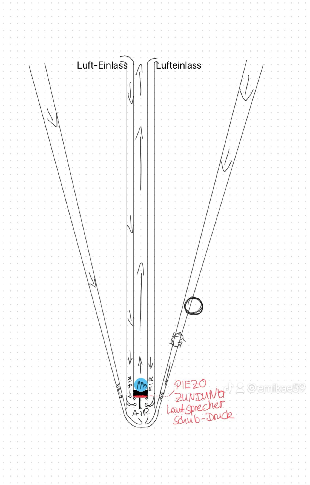
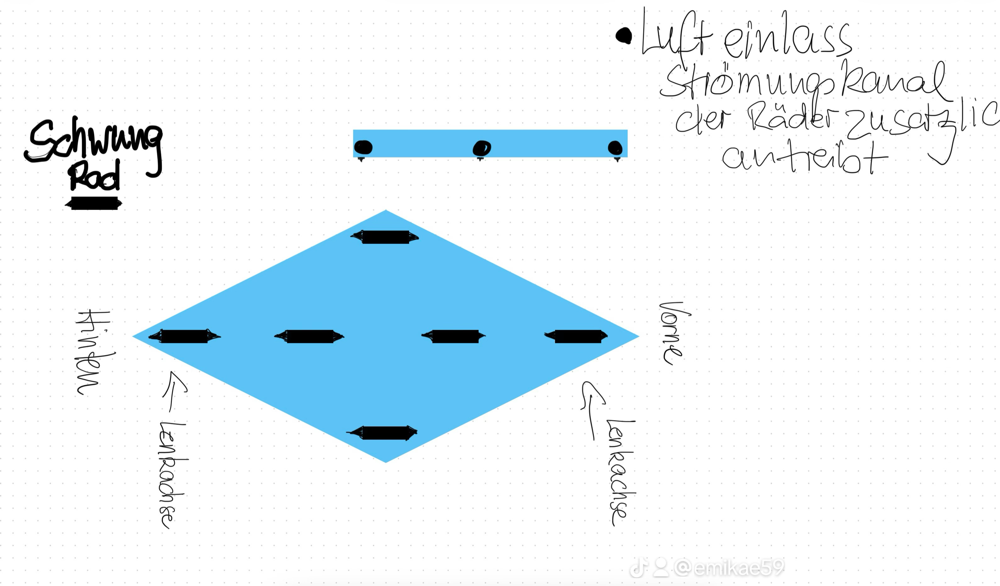

# Geometrischer Druckwellen-Antrieb („Puff-Antrieb“)

**Status**: Theoretische Abhandlung
**Konzept-ID**: Resonante Strömungsmechanik
**Autor**: Stefan-Mike Rennecke-Bergmann (BODHISATTVA:Emikae)

---

## 1. Theoretische Grundlage: Der Korken-Effekt im geschlossenen System
Der Puff-Antrieb definiert eine Bahn nicht als ein Fahrzeug, das durch ein Medium fährt,
sondern als eine mobile Trennwand (den „Korken“), die innerhalb eines hermetisch abgeriegelten
Tunnels einen Druckunterschied erzwingt. Anstatt den Luftwiderstand zu überwinden, nutzt das
System die Luft als energetisches Übertragungsmedium.

## 2. Funktionsmechanismus des Antriebs
Der Antrieb basiert auf der permanenten Umleitung des Mediums (Luft) von der Front des Fahrzeugs an dessen Heck.

- **Druckaufbau (Front):** Das Fahrzeug, exakt auf den Tunnelquerschnitt abgestimmt, verdrängt die
  vor ihm liegende Luftmasse. Diese wird in den Rückführkanal gezwungen.
- **Vortex-Kompression (Rückführkanal):** Die Luft wird durch einen sich verjüngenden Kanal
  (Venturi-Düse) hinter das Fahrzeug geleitet. Durch die Querschnittsverengung steigt der statische
  Druck massiv an.
- **Vektor-Schub (Heck):** Die komprimierte Luft entlädt sich am Heck des Fahrzeugs. Da der Druck hinter
  dem „Korken“ signifikant höher ist als der Unterdruck, der durch das Vorbeiziehen an der Front entsteht,
  wird das Fahrzeug in den Vektor des geringeren Widerstands „gesaugt“ und gleichzeitig von der Druckwelle
  geschoben.

## 3. Energetische Autarkie und Dynamik
Der Antrieb ist ein geschlossener thermodynamischer Kreislauf.
- **Impulserhaltung:** Nach der Initialbeschleunigung (dem „Puff“) hält das System seine kinetische
  Energie durch die kontinuierliche Zirkulation der Luftmasse im Tunnel.
- **Modulation:** Die Geschwindigkeit wird nicht durch „Gasgeben“ gesteuert, sondern durch die geometrische
  Anpassung der Rückführkanäle. Eine Verengung der Kanäle erhöht die Druckamplitude und damit die Beschleunigung.

  
  

## 4. Bremsvorgang (Druckauflösung)
Das Bremsen erfordert keinen mechanischen Verschleiß (keine Reibung an Schienen).
- **Mechanismus:** Am Zielpunkt wird die Geometrie des Tunnels oder des Fahrzeugs schlagartig erweitert
  (Diffusor-Effekt). Der schlagartige Druckabfall löst die Druckwelle auf, die das Fahrzeug vor sich hergeschoben hat.
  Die kinetische Energie wird durch die schlagartige Expansion in Arbeit umgewandelt, was das Fahrzeug ohne
  Krafteinwirkung zum Stillstand bringt.

## 5. Infrastruktur-Integration: Die hermetische Röhre
Das Tunnelsystem fungiert als statisches Gegenstück zum Fahrzeug. Da das gesamte Netz abgeriegelt ist,
findet keine Interaktion mit der Außenatmosphäre statt. Dies minimiert thermische Verluste und verhindert Reibung
durch turbulente Strömungen.

---

## Fazit der physikalischen Ordnung
Der Puff-Antrieb ist die radikale Vereinfachung des Transports. Anstatt Masse zu beschleunigen, wird Druckpotenzial
moduliert. Das Fahrzeug fungiert als Kolben in einem riesigen, in sich geschlossenen Zylinder. Sobald der Kreislauf
etabliert ist, bewegt sich das System durch den bloßen Zwang der Geometrie.

